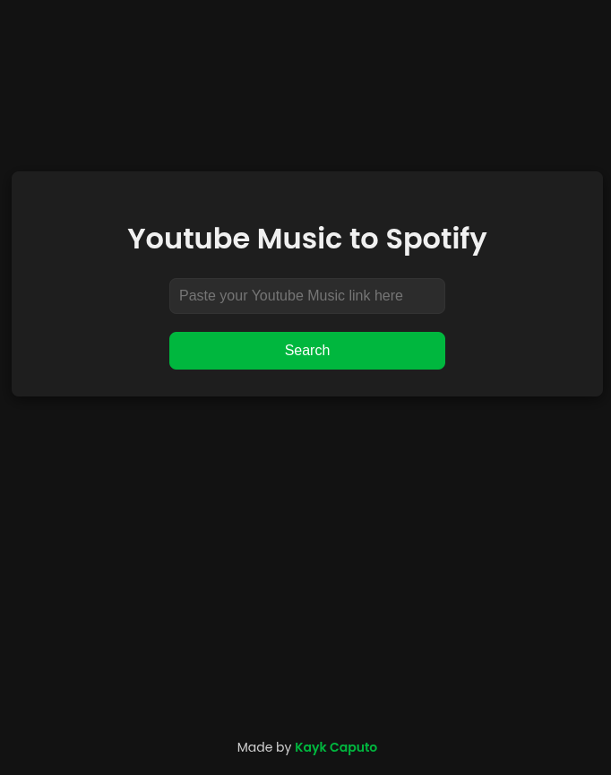
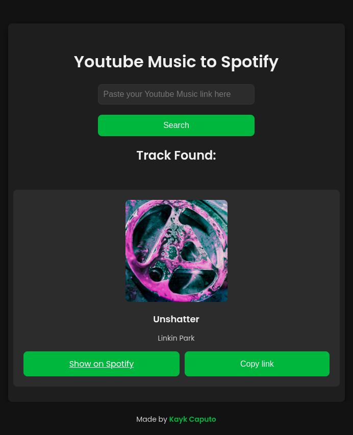

# 🎵 YouTube Music ➜ Spotify Converter

  
🔗 **Live Demo:** [yotubemsctospotify.onrender.com](https://yotubemsctospotify.onrender.com)

---

## 🚀 Overview

Convert **YouTube Music** links into their matching **Spotify** tracks in seconds — no account needed! Just paste a link, and get instant access to:

- 🎧 Track name
- 🎤 Artist
- 🖼️ Album art
- 🔗 Direct Spotify link

Perfect for sharing music across platforms — fast, simple, and stylish.

---

## ✨ Features

- 🔍 **Smart title extraction** from YouTube Music
- 📝 **Playlist support** now available!
- 🎯 **Spotify API integration** to match tracks accurately
- 📱 **Responsive, modern UI** for mobile & desktop

---

## 📸 Preview

> Paste. Click. Play. 🎶

<table>
  <tr>
    <td></td>
    <td></td>
  </tr>
</table>

---

## 🛠️ How to Use

1. Open the app ➡️ [yotubemsctospotify.onrender.com](https://yotubemsctospotify.onrender.com)
2. Paste any **YouTube Music link** or **Youtube link** into the input box
3. Hit **Search**
4. Instantly view the result and:
   - 🔗 Open in Spotify
   - 📋 Copy the Spotify link

---

## 💡 Why Use This?

Sharing music across platforms can be a pain. This tool removes that friction — no logins, no complexity. Just paste and go. Ideal for friends sharing tracks across platforms

---

## 📣 Try it Now!

🚀 [Click here to launch the converter](https://yotubemsctospotify.onrender.com)  
Let your music flow across platforms! 🎶

---

## ⭐ Support the Project

If you like this project, please consider giving it a **star** ⭐ on GitHub — it helps a lot!  
Contributions are **very welcome** 🛠️ — whether it's fixing a bug, adding a feature, or improving the UI. Feel free to open issues or submit PRs!

---

Made with ❤️ for music lovers.
